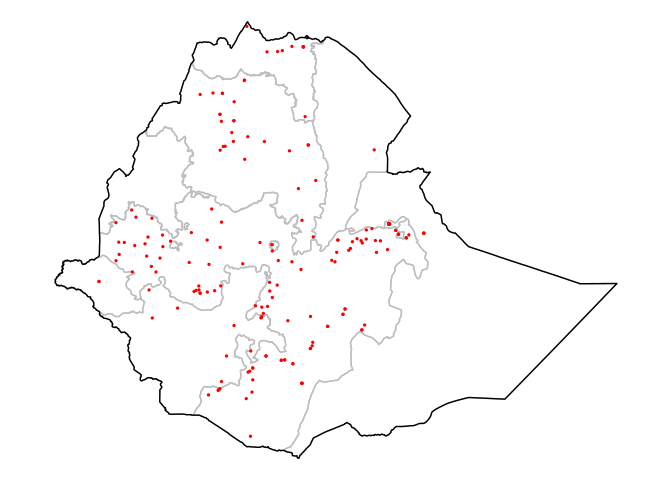

Research Project 2 - STH in Ethiopia
================

# Data sources

-   STH data:
    [ESPEN](https://espen.afro.who.int/tools-resources/download-data)
-   Altitude and landcover: [DIVA GIS](https://www.diva-gis.org/)
-   Friction surface and travel times: [Malaria Atlas
    Project](https://malariaatlas.org/)
    -   Friction surface recorded as minutes required to travel one
        meter, walking only and with motorized vehicle
    -   Travel time to nearest healthcare centre, in minutes

``` r
ggplot()+
  geom_sf(data = ETH_adm1, fill = NA, col = "grey")+
  geom_sf(data = ETH_adm0, fill = NA, col = "black")+
  geom_sf(data = sth_sf, size = 0.5, col = "red")+
  coord_sf()+
  theme_void()
```

<!-- -->

# STH Prevalence

WHO classifies prevalence into [three risk
groups](https://apps.who.int/iris/bitstream/handle/10665/44804/9789241503129_eng.pdf),
requiring mass-drug administrations at different frequencies. These risk
groups are classified as follows:

-   High risk, \>= 50% prevalence of any STH. Requires treatment twice a
    year.
-   Moderate risk, \< 50% and \>= 20% prevalence of any STH. Requires
    treatment once a year.
-   Low risk, \< 20% prevalence of any STH. No mass treatment required,
    done on a case-by-case basis.

# Models

## Generalised linear mixed-effects model (binomial)

 = x_i^\intercal\beta + Z_i")

## Geostatistical model (binomial)

 = x_i^\intercal\beta + S(x_i) + Z_i ")

# Predicted prevalence

## Hookworms
